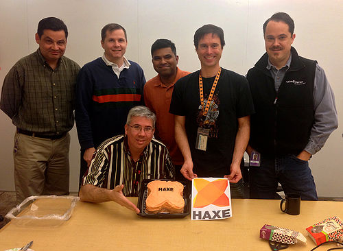

### The Flash Code was Dead

It was Saturday, 24th of May 2014, the second day of the World Wide Haxe Conference. I and about 60 other members of the Haxe community were sitting in a dimly lit room in a college somewhere in Paris, France. Todd Kulick, Vice President of Technology at TiVo was giving his presentation called “Shipping one million lines of Haxe to one million devices”. In it, he explained how TiVo converted their one million lines of AS3 code that made up their UI to Haxe, which would then be shipped to their set-top boxes later that summer. He was walking us through their whole process, from how TiVo evaluated Haxe as an alternative to Flash to which technologies it replaced and how their conversion process went. Then, a slide with a timeline came up. Todd looked into the room and said: “At this point, we flipped the switch and the Flash code was dead”. We all sat there in stunned silence, either too surprised to react or not really grasping what he had just said. “The Flash code was dead”, repeated Todd. Then, the reality of the statement hit home.

> TiVo was able to build a working Haxe prototype of their UI which, out of the box, was already 30% faster than the Flash version.

### Bridging Devices and Making Things Faster

If you are not familiar with TiVo’s products, let me just give you a quick rundown. They are most widely known for their DVRs, small set-top boxes that allow you to record multiple TV programs as well as stream the recordings to the connected TVs and other devices. Previously, the user interface of these set-top boxes had been based on Flash and AS3. Using Flash had been an acceptable solution until that point, but it was far from perfect. The support and further development for Flash was waning, since Adobe decided not to invest in it in the future. Because of that, less and less devices would continue to support Flash, effectively excluding TiVo and other users from whole market segments or at least heightening the barriers of entry significantly. This applied especially to the very fast growing market for mobile devices and solutions. Targeting new devices and providing new features was becoming harder and harder.

After considering their options, TiVo decided to try Haxe, since it would address their problems as well as allow them to build on their already existing codebase. The conversion from AS3 code to Haxe code was done automatically, using an already existing converter. TiVo was able to build a working Haxe prototype of their UI which, out of the box, was already 30% faster than the Flash version. Not only did this show that Haxe was a viable solution, it showed that Haxe was a better solution.

That was the state of things at last year’s WWX. Since then, TiVo has converted their code, shipped their product and improved upon the initial version. Last summer, the new code was successfully rolled out to over one million devices. I was – and still am – very excited about how TiVo is using Haxe, since there are not many examples of its application at such a large scale. Naturally, I was also very curious as to how things went and whether Haxe still seemed to be the right way to go one year later. It’s not often that I get to observe a project like this from the start. So, giving in to my curiosity, I went and contacted Todd for some more information and a status update. We talked about the release experience and about some more recent developments. If you are following this year’s WWX, you will get a first-hand account of some of the things we talked about, so be sure not to miss it.

> TiVo confirmed that their users did not only notice the change, but celebrated it vocally... "net promoter" metrics are at an all-time high.

### Faster Applications Make for Happier Customers

Looking at the initial results of switching to Haxe, one of the most impressive things about the switch to Haxe was that the initial prototype was already running 30% faster. Just like that, out of the box. Naturally, I wanted to know, whether those numbers held up. As it turns out, they did. According to Todd, the final release software candidate had a very similar performance profile to the initial prototype and in some important use cases, the performance was even better than expected. The new Haxe-based user interface also gave the older boxes with slower hardware a new “lease on life”, making them more performant. Those boxes became around 30% faster just by getting the new software.

Now, you might ask yourself if a 30% faster performance is a big enough change to get noticed by customers. It most certainly is.

TiVo confirmed that their users did not only notice the change, but celebrated it vocally. Everyone who sells a service-related product knows how important customer satisfactions is. Being able to deliver significant improvements, especially to customers with older hardware, is vitally important for business success. Todd Kulick, TiVo’s Vice President of Technology says:

_“We are known for having a vocal user community and they (the users) let us know when they aren't happy.  They loved the improvements that Haxe brought to the product.”_

TiVo also reports that their customer performance dissatisfaction metrics have dropped to almost zero in their testing populations and that their “likelihood to recommend” and “net promoter” metrics are at an all-time high.
All in all, it seems as if Haxe did not only help TiVo solve their initial problem, it also helped them to deliver meaningful improvements to their customers which is paramount to their success.

> In TiVo’s case, the new Haxe-based UI means that their developers can now spend more time on developing new features and less time on micro-optimizations in Flash.

### Don’t work more, work smarter

Of course, the customer is not the only part of this story. Having worked in the software industry for some years, I know that one of the biggest factors in any project is the development cost in terms of the time being spent by developers. The increasing complexity of multi-platform solutions cannot simply be addressed by putting more work hours into the problem. Doing so would quickly escalate the time spent on product development, and thus strain business resources. Making use of Haxe’s inherent cross platform features addresses this beautifully, allowing programmers to work smarter and more effectively instead of just increasing the time involved exponentially with every added platform.

In TiVo’s case, the new Haxe-based UI means that their developers can now spend more time on developing new features and less time on micro-optimizations in Flash. New functionality can be added faster and developments can even be shared across different platforms and devices such as set-top boxes and mobile phones. By the time you read this article, TiVo will probably have shipped their first non-set-top box Haxe product, which is amazing, if you consider that they are only at the beginning of their journey. Not only have they started using Haxe in their Android applications, but with their new Haxe core library, they were also able to implement a lot of policy functions that work the same way across all targeted devices, effectively increasing the shareable code and further decreasing time spent on development. Continuing to leverage Haxe in this way has become part of TiVo’s long-term strategy to make product and feature development more efficient and reduce time spent on re-writing code for different devices. The best thing though is the fact that they are not only using Haxe, but also sharing their results with the Haxe community, so that others can learn and participate.

> I am honestly impressed and amazed by the core Haxe team's ability to listen, hear and act on the needs of their users. They should be extremely proud of that accomplishment.

### New Insights and Positive Energy from the Community

Talking with me, Todd mentioned that another great benefit of making the switch to Haxe was the exhilarating experience of learning something new and putting it to practice. He says, that the infusion of positive energy and new ideas from outside TiVo that came from the Haxe community and core developers were a huge boost for him and his team. Even though there can always be confusion, when one is learning something new, the transformation has shaken up TiVo’s status quo and helped refresh their thinking. I, for one, was very happy to hear this and hope that this sort of thinking continues. Learning is essential to progress and having a great community to learn from and learn with is a very valuable thing to have.

I am glad to see that TiVo actively participates in community events, such as the yearly Haxe conference, and loves to exchange ideas and collaborate with other Haxe contributors. I think we are all benefitting from their unique perspective and expertise.

When asked about further improvements that they would like to see, Todd mentions:

_“I'm repeatedly surprised to find that many issues that we find in our work here are already under discussion and consideration amongst the community members. I am honestly impressed and amazed by the core Haxe team's ability to listen, hear and act on the needs of their users. They should be extremely proud of that accomplishment._

_I am similarly impressed with the toolkit work done by both Joshua Granick and Hugh Sanderson. The numerous layers of technology built on top of their contributions shows the value that others find in their work.”_

At this year’s Haxe conference, Todd and his colleagues will be back and talk about their experience and the progress made during the last year. They will also talk about their new “activities” haxelib, a recent project where they are actively looking for collaboration and input from the community. IF you are interested, make sure to look by and participate.

* [See TiVo's "Activity" project on Github](https://github.com/TiVo/activity)
* [See Google Group discussion](https://groups.google.com/forum/#!searchin/haxelang/activities/haxelang/yEhXuwmVV3c/vfrsmgq6xMoJ)

### Final Thoughts

To me, TiVo is a pioneer when it comes to evaluating and adopting Haxe for large-scale projects on a corporate level. During the last three years, they have made an impressive journey, from first evaluating the technology to having Haxe run on millions of devices all over the world. Making the switch has not only improved their existing products, but also opened the door for a full range of new features and platforms. Targeting mobile devices and providing modern features to already existing devices has become a lot easier. Apart from the technical benefits, discovering a new technology and connecting with the Haxe community has given their development team a huge infusion of positive energy and new ways of thinking. Connecting with TiVo and learning about their experience with Haxe has given me a very unique insight into what is involved in adopting it and making it fit on a corporate scale. This sort of feedback is extremely valuable and, hopefully, will help us take Haxe a few steps further along the way to becoming more widely used and recognized.
